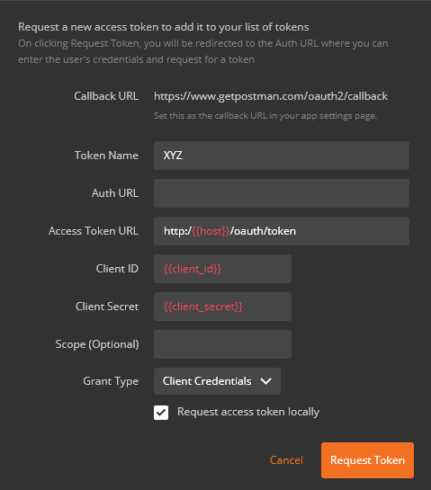

# OAuth JWT Authentication Server

This application is simple authentication server which is exposing two JWT token end point :-

1. **/oauth/token_key** (to get the public key which will be used by resource server to verify the signature)
2. **/oauth/token** (to get jwt access token)


## Setup

1. place key-store file `keystore.jks` under src/main/resources/ 
2. Specify key-store file name, password, client_id & client_secret in `application.yml`
3. Start the project `AuthserverApplication.java`

## /oauth/token_key

```curl

curl -X GET http://{{host}}/oauth/token_key -H "cache-control: no-cache"

```

## /oauth/token

```

curl -X POST \
  http://{{host}}/oauth/token \
  -H 'authorization: Basic XXXXXXX' \
  -H 'cache-control: no-cache' \
  -H 'content-type: application/x-www-form-urlencoded' \
  -d grant_type=client_credentials

```

OR, through postman




## References

[Key-Store](https://docs.oracle.com/cd/E19798-01/821-1841/gjrgy/)